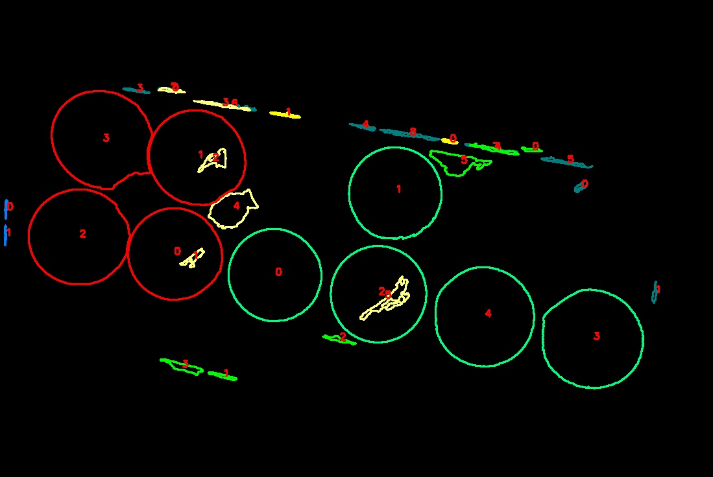

# Repeat Pattern Counting

## Preparation
(Images are available from https://ppt.cc/ffLrKx)

* put color imgs(det_imgs) in `input/image`
* put structure forest edge imgs(det_edges) in `input/edge_image`
* put HED edge imgs(hed_edges) in `input/hed_edge_image`
* modify configs in `config.ini`

## How to run
for old version
* `cd legacy_code` and run `python find_repeat_pattern.py`

for new version
* `cd src`
* if only test one picture:
    1. run `python main.py --test --img "IMG_ (39).jpg"`
* if test several pictures:
    1. modify `img_list` in config.ini like `img_list = IMG_ (39).jpg, IMG_ (10).jpg, IMG_ (16).jpg`
    2. run `python main.py`
* if test all images in a folder:
    1. modify `input_dir`, `strct_edge_dir` and `hed_edge_dir` in config.ini
    2. run `python main.py --test_all`
* add `--draw` if want to draw all process pictures 
* add `--mark` if want to see every contour number in plots

## Result
* marked contour

* some results

